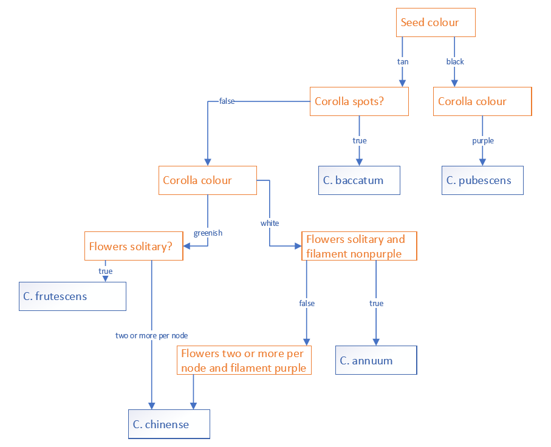
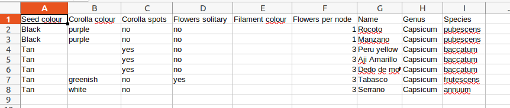

# pythonml
Playing with python machine learning

Based on the decision tree and the sample data, I want to create a model that can classify Capsicum species based on seed colour, corolla colour, corolla spots, flowers solitary, filament colour and flowers per node.

# Capsicum decision tree

# Sample data
